# Drawing App

This app allows users to make and save drawings. This app has been made keeping **simplicity** and **elegance** in mind. The paragraphs below explain the functionalities and the user interface of the app. This can also be thought of like a user guide for this app.   Happy Drawing!
   

## Table of Contents  
 - [Add a new Drawing](#add-a-new-drawing)  
 - [Edit a Drawing](#edit-a-drawing)  
 - [Save a Drawing](#save-a-drawing)
 - [Searching for a Drawing](#searching-for-a-drawing)
 - [Delete a Drawing](#delete-a-drawing)
 - [Future Features](#future-features)
 
<a name="add-a-new-drawing"/>

## Add a new Drawing

When the blue *FloatingActionButton* at the bottom right corner of the screen is clicked, the app automatically creates a new drawing with a default naming system. In the case below, a drawing with name **New Drawing 2** is created when the *FloatingActionButton* is clicked.
  
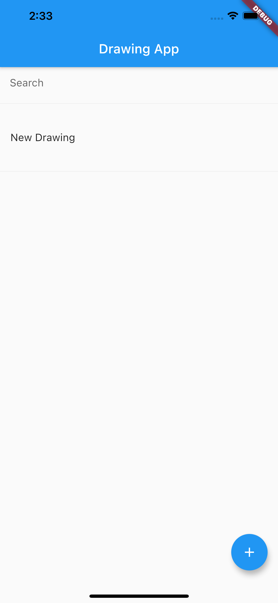 
 
<a name="edit-a-drawing"/>

## Edit a Drawing

The default drawing color is set to *grey[600]*. The entire canvas can be cleared by clicking on the red *FloatingActionButton* at the bottom right corner of the screen. The the case below, the drawing **New Drawing 2** is being edited. The writing **Hello** is cleared after the *FloatingActionButton* is clicked. Then the word **World** is written.
 
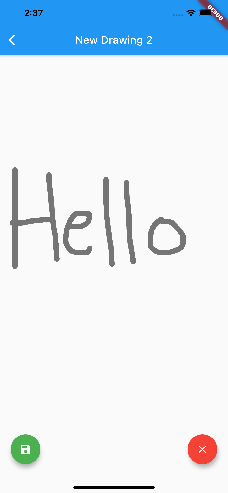 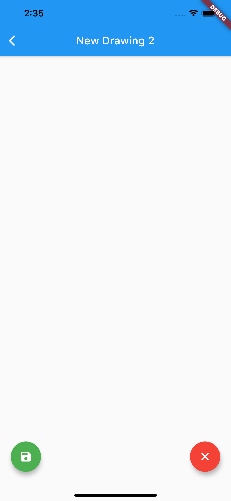 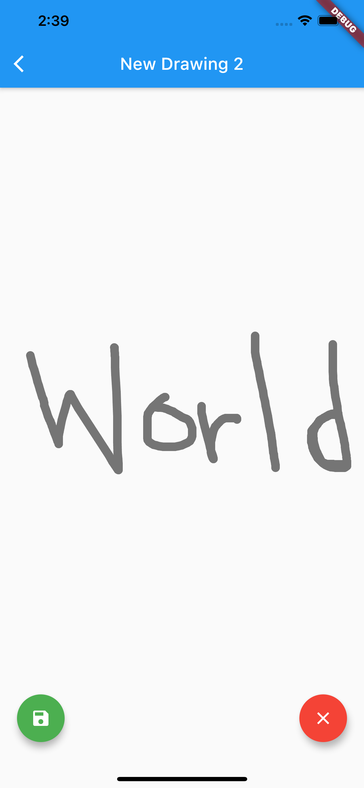
  
<a name="save-a-drawing"/>
## Save a Drawing

A drawing can be saved by clicking on the green *FloatingActionButton* at the bottom left corner of the screen. Once clicked, a popup dialog box appears where the user can **also rename** the drawing. In the case below, the drawing **New Drawing 2** renamed and saved as **Hello World**.
 
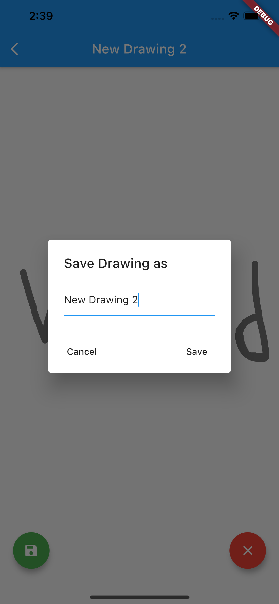 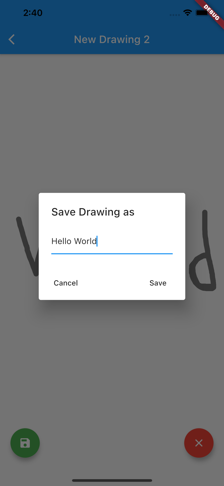 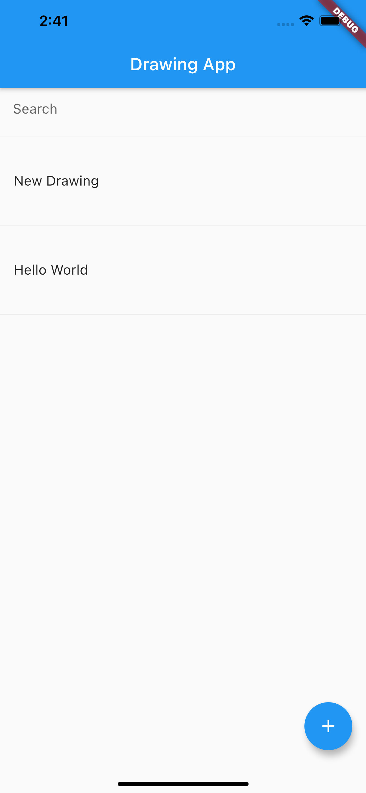
 
To check that the drawing has actually been saved, we can click on ~~New Drawing 2~~ **Hello World**. This file can be further edited and saved as needed.
 
 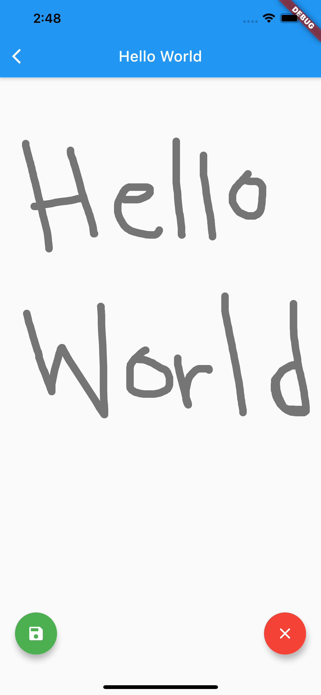 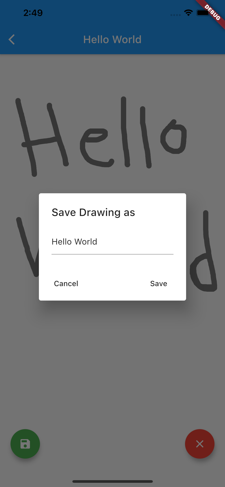
  
<a name="searching-for-a-drawing"/>
## Searching for a Drawing

The user can search for a drawing but typing any substring of the drawing name into the search bar. All the drawings which conatin the input text in their name are shown. The drawings are auto-updated as the user types the text.
 
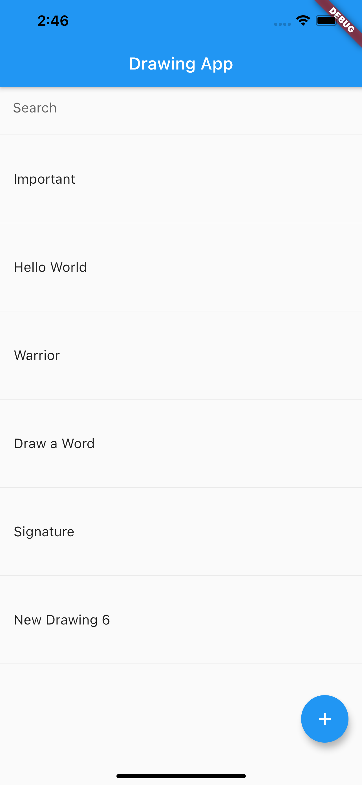 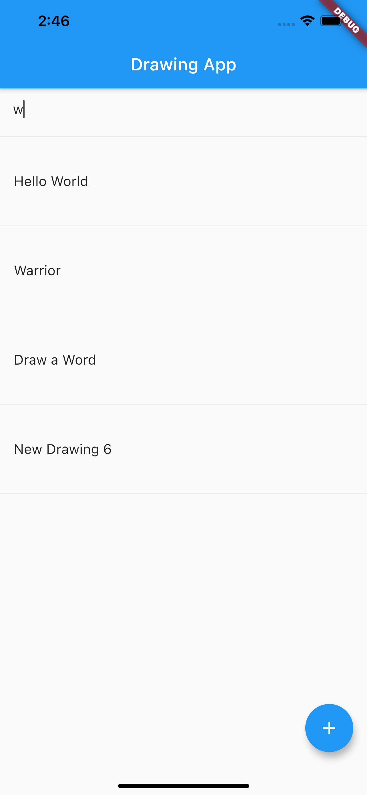 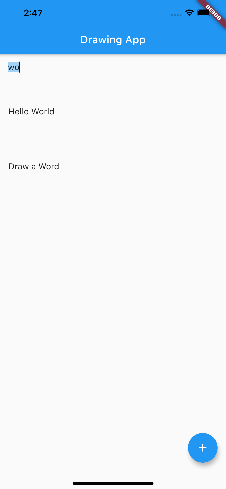
  
<a name="delete-a-drawing"/>
## Delete a Drawing

A drawing can be deleted by sliding it's name from right to left or from left to right. Once a drawing has been deleted, a *SnackBar* alert appears from the bottom of the screen broadcasting the name of the drawing that has been deleted. In the case below, the drawing **Warrior** is being deleted. After deletion, the *SnackBar* shows the message **"Warrior has been deleted"**.
 
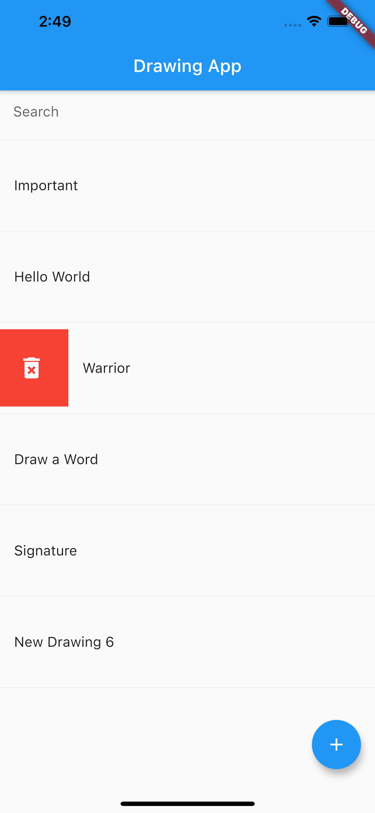 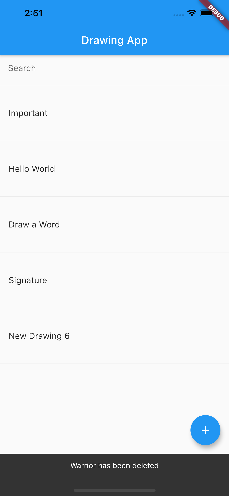
 
<a name="future-features"/>
## Future Features

 - Changing pen color
 - Changing stroke weight
 - Sharing drawings via social media
 - Undo/redo buttons
